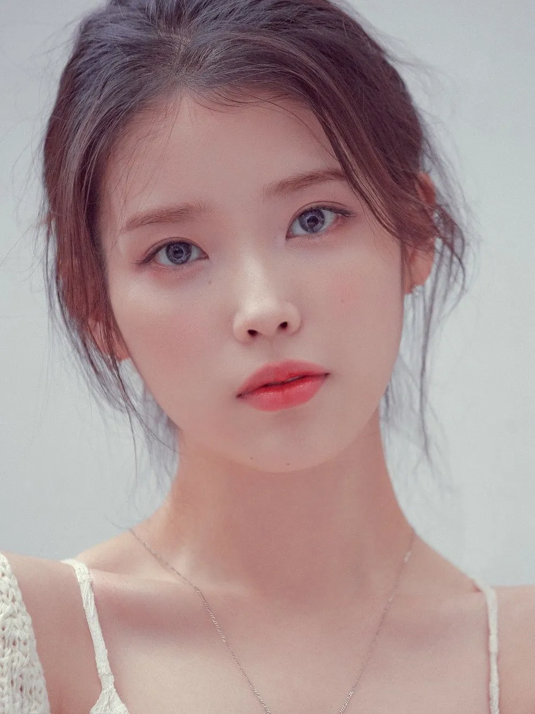
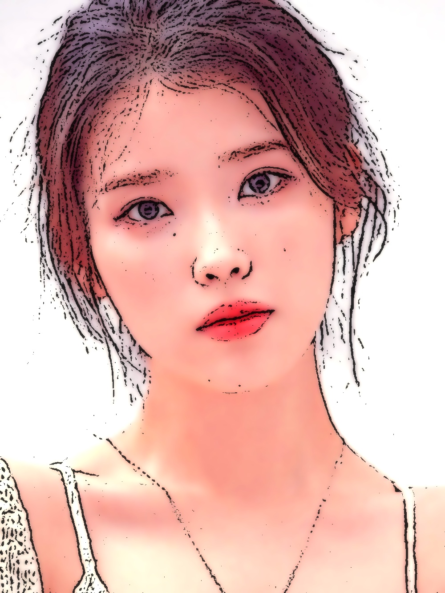
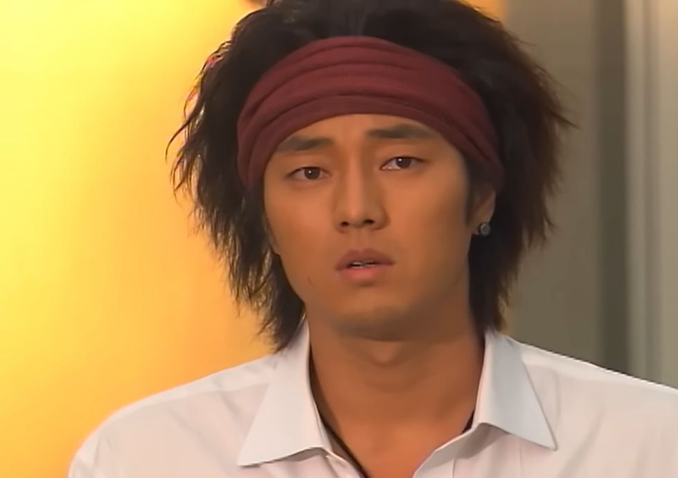
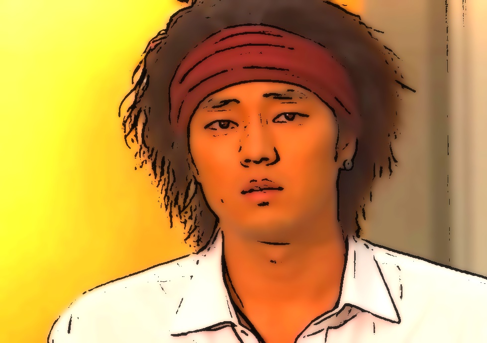

# Cartoon Rendering 

## 1. 만화 같은 느낌이 잘 표현되는 이미지 데모
| 원본 이미지 | 렌더링 결과 |
| :---: | :---: |
|  |  |

---

## 2. 만화 같은 느낌이 잘 표현되지 않는 이미지 데모
| 원본 이미지 | 렌더링 결과 |
| :---: | :---: |
|  |  |

**특징:** 조명이 어둡거나 역광인 사진, 지나치게 복잡한 배경(나뭇잎, 군중, 자잘한 패턴 등)이 있거나 얼굴에 짙고 불규칙한 그림자가 진 사진에서는 만화적인 느낌을 살리기 어렵습니다.
*(극단적인 명암이나 복잡한 질감이 있으면 렌더링 과정에서 얼룩처럼 뭉개지거나, 선화(Edge)가 지저분한 노이즈로 잡혀 일러스트 느낌이 크게 감소합니다.)*

---

## 3. 본 알고리즘의 한계점 (Limitations)
1. **과도한 밝기/채도 부스팅으로 인한 화이트홀 현상 (Color Clipping)**
   - 애니메이션 특유의 맑은 일러스트 톤을 내기 위해 일괄적으로 Red/Green 채널과 전체 채도/명도 값을 증폭시키고 있습니다.
   - 이로 인해 **이미 원래 밝거나 붉은 기가 많은 사진**에 적용하면 픽셀 값이 최대치(255)를 초과하여 색상과 디테일이 하얗게 타버리는(White-out) 단점이 있습니다.

2. **복잡한 텍스처(질감)와 엣지(Edge) 추출의 충돌**
   - 부드러운 연필선 느낌을 내기 위해 `adaptiveThreshold` 등을 사용하지만, 이는 명암 차이에 매우 민감합니다.
   - 배경의 나뭇잎, 옷의 복잡한 패턴, 노이즈가 심한 화질의 사진을 넣으면 전부 검은색 윤곽선으로 추출되어, 만화 특유의 '면으로 깔끔하게 나누어진 느낌'이 아닌 **지저분한 스케치나 연필 얼룩처럼 보이게 됩니다.**

3. **강한 그림자와 빛의 경계 처리의 부자연스러움 (Bilateral Filter 한계)**
   - 피부나 면의 질감을 수채화처럼 부드럽게 뭉개기 위해 `Bilateral Filter`를 여러 번 반복 적용(에어브러시 효과)합니다.
   - 하지만 콧대 밑의 짙은 그림자나 역광으로 인한 극단적인 명암 차이는 이 스무딩 필터로도 자연스럽게 그라데이션되지 않으며, 마치 **찰흙 덩어리처럼 어색하게 색상이 분리되어** 이질감을 줍니다.

4. **전역 글로우(Bloom) 필터의 한계**
   - 뽀샤시한 픽시브 느낌을 내기 위해 이미지 전체 범위에 `GaussianBlur` 후 `addWeighted`로 발광(Glow) 효과를 덧씌웁니다.
   - 화사한 사진에는 매우 잘 어울리지만, **크게 어둡고 묵직해야 할 부분(예: 밤하늘, 검은색 옷, 짙은 밤 배경 등)까지 강제로 뿌옇고 탁해지는 (Washed-out)** 부작용이 발생합니다.
